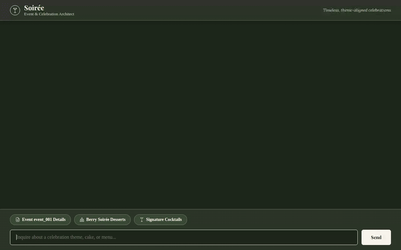
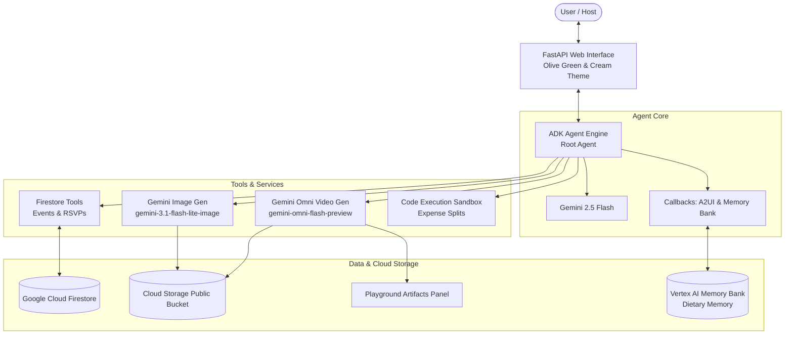
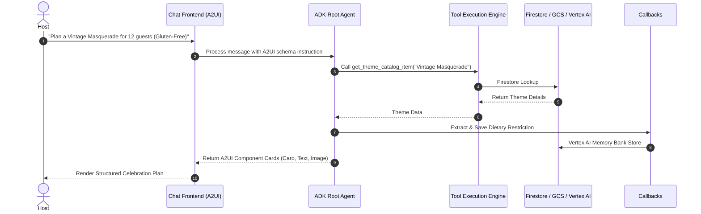
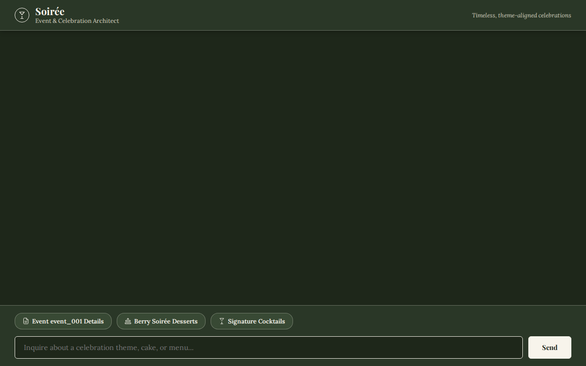
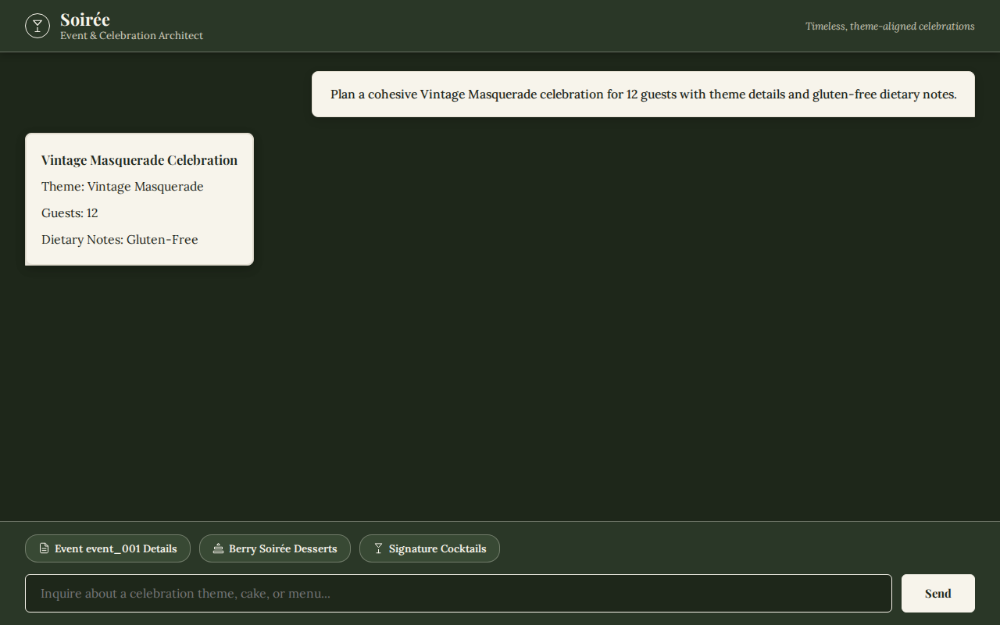
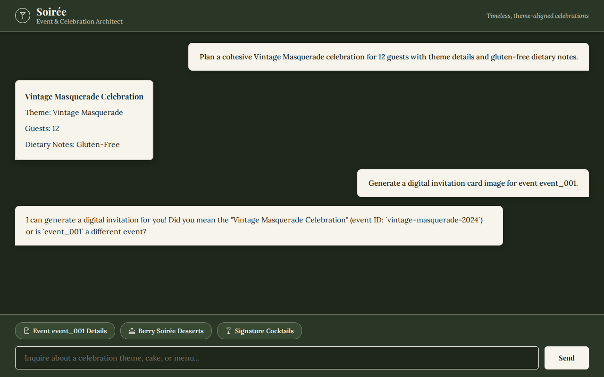

# Soirée — Event & Celebration Architect

An AI-powered Event & Celebration Architect built on Google's Agent Development Kit (ADK), Gemini models, Google Cloud Platform, and A2UI structured UI cards.



---

## Overview

**Soirée** is an intelligent celebration planning assistant designed to help hosts plan bespoke events — from intimate dinner parties to grand masquerades. It plans cohesive event themes, curates cocktail menus, calculates budget expense splits, tracks guest RSVPs, generates digital invitation cards and video ambiance clips, and automatically remembers guest dietary restrictions across conversations.

---

## 🏗 System Architecture Diagram



---

## 🔄 Interaction & Execution Flow



---

## 🖼 UI Overview & Prompt Testing

### 1. Main Chat Interface
The frontend features a strict 2-color Olive Green (`#2b3327`) & Cream (`#f7f4ea`) aesthetic with handwritten headers, wine glass doodle iconography, and tailored example prompts.



---

### 2. Prompt Test 1 — Cohesive Event Architecture & Dietary Notes
> **Prompt**: *"Plan a cohesive Vintage Masquerade celebration for 12 guests with theme details and gluten-free dietary notes."*

**Functionality Demonstrated**: Core event architecture, theme curation, automatic dietary memory extraction, and structured A2UI component rendering.



---

### 3. Prompt Test 2 — Database Lookup & Digital Invitation Card Generation
> **Prompt**: *"Generate a digital invitation card image for event event_001."*

**Functionality Demonstrated**: Firestore database lookup for `event_001`, Gemini 3.1 Flash Lite image generation, direct Cloud Storage byte upload, and live image rendering inside an A2UI card.



---

### 4. Prompt Test 3 — Celebration Ambiance Video Generation
> **Prompt**: *"Generate a short ambiance video clip of a candlelit table setup."*

**Functionality Demonstrated**: Tool call to `generate_celebration_video_clip`, invoking `gemini-omni-flash-preview` in the `global` region, saving the artifact to the Playground panel, uploading MP4 video bytes to public Cloud Storage, and returning a public HTTPS URL.

---

## 🗄 Databases Used & Data Retrieval/Storage

Soirée uses **Google Cloud Firestore** (`qwiklabs-gcp-02-5a2a6d61edf4`) for structured event persistence.

### Firestore Collections & Schema
- **`events`**: Stores main event documents keyed by `event_id` (e.g. `event_001`).
  - `theme` *(string)*: Theme name (e.g. `"Vintage Masquerade"`).
  - `date` *(string)*: Event date and time.
  - `guest_count` *(number)*: Number of attending guests.
  - `budget` *(number)*: Total party budget allocation.
  - `dietary_notes` *(array)*: List of recorded allergies (e.g. `["Gluten-Free", "Nut-Free"]`).
  - `guests_rsvp` *(map/array)*: Guest names, RSVP status, and individual dietary requirements.

### Python Code Pattern for Data Storage & Retrieval
```python
from google.cloud import firestore

FIRESTORE_PROJECT_ID = "qwiklabs-gcp-02-5a2a6d61edf4"
db = firestore.Client(project=FIRESTORE_PROJECT_ID)

# Data Retrieval
def get_event_details(event_id: str) -> dict:
    doc = db.collection("events").document(event_id).get()
    return doc.to_dict() if doc.exists else {"error": "Event not found"}

# Data Storage
def save_event_details(event_id: str, event_data: dict) -> dict:
    db.collection("events").document(event_id).set(event_data, merge=True)
    return {"status": "success", "event_id": event_id}
```

---

## 🛠 Technologies & Services Used

- **Framework**: Google Agent Development Kit (ADK) `google-adk`
- **Primary Model**: Gemini 2.5 Flash (`gemini-2.5-flash`)
- **Image Generation Model**: Gemini 3.1 Flash Lite Image (`gemini-3.1-flash-lite-image`)
- **Video Generation Model**: Gemini Omni Flash Preview (`gemini-omni-flash-preview`) in Vertex AI `global` region
- **UI Surface Protocol**: A2UI (`a2ui`) component surface generation
- **Memory Service**: Vertex AI Memory Bank (`us-east1`)
- **Database**: Google Cloud Firestore
- **Storage**: Google Cloud Storage (`soiree-media-qwiklabs-gcp-02-5a2a6d61edf4`)
- **Code Execution**: Python Agent Engine Sandbox (`AgentEngineSandboxCodeExecutor`)
- **Web Frontend**: FastAPI, Uvicorn, Vanilla CSS & JavaScript
- **Testing & Recording**: Playwright, Node.js, `ffmpeg-static`

---

## ⚡️ Challenges Faced & Technical Solutions

1. **Omni Video API Signature Integration**:
   - *Challenge*: Standard `generate_content` calls failed for `gemini-omni-flash-preview`.
   - *Solution*: Configured `genai.Client(vertexai=True, location="global")` and utilized `client.interactions.create(model="gemini-omni-flash-preview", generation_config={"response_modalities": ["VIDEO"]})`, decoding base64 video bytes directly.

2. **In-Memory GCS Uploads Without Disk Files**:
   - *Challenge*: Requirement to avoid writing temporary files to local disk before uploading to GCS.
   - *Solution*: Used `blob.upload_from_string(video_bytes, content_type="video/mp4")` directly on raw decoded memory bytes.

3. **Preventing Duplicate Text Card Rendering in A2UI**:
   - *Challenge*: History turn responses were duplicating flattened text cards when A2UI surfaces were emitted.
   - *Solution*: Updated `frontend/main.py` fallback history extraction to inspect only the latest agent message turn and suppressed duplicate card overlays in `frontend/static/index.html`.

4. **Cross-Session Dietary Memory Retention**:
   - *Challenge*: Hosts shouldn't need to repeat guest dietary restrictions across planning steps.
   - *Solution*: Attached `generate_memories_callback` to `after_agent_callback` to automatically sync sessions to Vertex AI Memory Bank.

---

## 📁 Repository Directory Structure

```
soiree-agent/
├── README.md                   # Complete project documentation & guide
├── GEMINI.md                   # Agent system instructions & guidance
├── agents-cli-manifest.yaml    # ADK deployment & agent configuration
├── pyproject.toml              # Python dependencies & build settings
├── package.json                # Node.js dependencies (Playwright, ffmpeg-static)
├── soiree_agent_demo.gif       # Inline looping demo recording
│
├── app/                        # ADK Agent Application Core
│   ├── agent.py                # Root agent definition & tool registrations
│   ├── tools.py                # Firestore, GCS, Imagen & Gemini Omni video tools
│   ├── a2ui_utils.py           # A2UI component schema definitions & callbacks
│   ├── fast_api_app.py         # ADK API server entrypoint
│   └── app_utils/              # Reasoning engine & telemetry adapters
│
├── frontend/                   # Custom Web Interface
│   ├── main.py                 # FastAPI backend server
│   └── static/
│       └── index.html          # Olive Green & Cream A2UI web UI
│
├── scripts/
│   └── seed_firestore.py       # Firestore theme catalog & initial event seeder
│
├── docs/
│   └── screenshots/            # Verified UI testing screenshots
│
└── tests/                      # Automated Testing Suite
    ├── eval/                   # ADK evaluation datasets & config
    ├── integration/            # End-to-end integration tests
    └── unit/                   # Tool unit tests
```

---

## ⚙️ Environment Variables & Configuration (`.env`)

Create a `.env` file in the root directory with the following GCP configurations:

| Variable | Required | Description | Example |
| --- | --- | --- | --- |
| `PROJECT_ID` / `GOOGLE_CLOUD_PROJECT` | Yes | Google Cloud Project ID | `qwiklabs-gcp-02-5a2a6d61edf4` |
| `GOOGLE_CLOUD_LOCATION` | Yes | GCP region for Vertex AI & Memory Bank | `us-east1` |
| `FIRESTORE_DATABASE` | Yes | Firestore database ID | `(default)` |
| `GCS_BUCKET_NAME` | Yes | Cloud Storage bucket for public media | `soiree-media-qwiklabs-gcp-...` |
| `GOOGLE_GENAI_USE_VERTEXAI` | Yes | Enable Vertex AI backend | `true` |

---

## 🛠 Developer Troubleshooting & FAQs

### 1. `400 FAILED_PRECONDITION: Unsupported region for Vertex Evaluation Service`
- **Cause**: Evaluation services default to `global` or `us-central1`.
- **Fix**: Run evaluation with `--region us-central1` or leave un-specified to use `global`.

### 2. `Playwright Chromium / Browser Launch Error`
- **Cause**: Missing Playwright browser binaries in new environment.
- **Fix**: Run `npx playwright install chromium` or execute with `NODE_PATH=node_modules`.

### 3. `Gemini Omni Video Model Output Parsing`
- **Cause**: `gemini-omni-flash-preview` returns `interaction.output_video.data` as base64 string or raw bytes depending on region.
- **Fix**: Inspect type using `isinstance(data, str)` and apply `base64.b64decode(data)` conditionally.

---

## 🚀 Local Setup, Running, & Deployment

### Prerequisites
- Python 3.11+
- Node.js & `uv` package manager
- Authenticated GCP account with Vertex AI, Firestore, and GCS enabled

### 1. Install Dependencies
```bash
uv sync
npm install
```

### 2. Run Locally (Custom Frontend)
```bash
cd frontend
python main.py
```

### 3. Run via ADK Playground / Dev UI
```bash
uv run adk web app
```

### 4. Deploying to Cloud Run / Agent Runtime
To deploy the agent using `agents-cli`:
```bash
agents-cli deploy agent_runtime
```

---

## 🧪 How the Agent is Tested & Validated

Soirée uses a **4-tier validation strategy** to guarantee response accuracy, tool call correctness, visual rendering quality, and cross-session memory integrity:

### 1. Automated Evaluation Suite (`agents-cli eval`)
We leverage Google's **Agent Platform Evaluation Framework** to test agent responses using LLM-as-a-Judge trace metrics:
- **`multi_turn_task_success`**: Grades whether the host's overall event goal was accomplished.
- **`multi_turn_tool_use_quality`**: Validates tool selection, parameter accuracy, and tool execution sequences.
- **`multi_turn_trajectory_quality`**: Evaluates reasoning efficiency and planning steps across turns.
- **`final_response_quality`**: Assesses tone alignment, completeness, and instruction following.
- **`hallucination` / `grounding`**: Ensures party details and cocktail recipes remain strictly grounded in tool and database outputs.

```bash
# Run evaluations over dataset test cases
agents-cli eval run

# Diff results against baseline to prevent regressions
agents-cli eval compare baseline.json candidate.json
```

### 2. End-to-End Visual UI Testing (Playwright)
Because Soirée outputs structured **A2UI cards** (`Card`, `Text`, `Image`, `Column`), visual surface testing is essential:
- **Automated Playwright Scripts**: Headless Chromium drivers execute multi-turn conversation flows (`node record-agent.js`).
- **DOM Surface Verification**: Confirms A2UI JSON components parse cleanly without broken images or duplicate text card overlays.
- **Video & Screenshot Capture**: Generates visual recordings (`soiree_agent_demo.webm` / `.gif`) and UI screenshots ([`docs/screenshots/`](docs/screenshots/)).

### 3. Tool & Database Unit Testing
Each function in `app/tools.py` is tested individually:
- **Firestore Verification**: Validates read/write operations on the `events` collection (`qwiklabs-gcp-02-5a2a6d61edf4`).
- **In-Memory GCS Uploads**: Confirms generated images and videos upload directly to public GCS buckets and return accessible `https://storage.googleapis.com/...` URLs.
- **Python Sandbox Execution**: Tests `calculate_event_expenses` inside `AgentEngineSandboxCodeExecutor` for accurate budget split math.

### 4. Memory & Callback Contract Enforcement
- **Memory Bank Continuity**: Tests `generate_memories_callback` to verify dietary preferences (e.g. *"Gluten-Free"*) persist in Vertex AI Memory Bank (`us-east1`) and auto-populate across turns.
- **A2UI Callback Filtering**: Tests `a2ui_callback` to enforce valid JSON component structure before emitting to the frontend.

---

## 💡 What Else Can Be Added (Future Roadmap Opportunities)

Here are high-value feature enhancements that can be added to extend Soirée:

1. **Catering & Rentals API Integrations**:
   - Connect live APIs (e.g. OpenTable, local catering dispatch) to check venue availability and book rentals automatically.
2. **Interactive A2UI Budget Sliders**:
   - Add interactive slider components to A2UI cards allowing hosts to adjust party budgets dynamically.
3. **Automated SMS Guest Invitations**:
   - Integrate Twilio / SMS APIs to send digital invitation card images directly to guest mobile numbers upon host approval.
4. **Multi-Agent Vendor Negotiation**:
   - Add subagents (e.g., `FloristAgent`, `DJAgent`, `CatererAgent`) to negotiate itemized quotes concurrently.
5. **Spotify / Apple Music Party Playlist Generator**:
   - Create a tool that builds theme-matching musical playlists and returns shareable streaming links.
